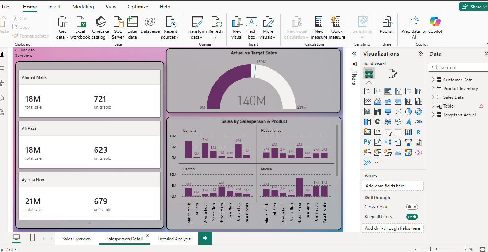
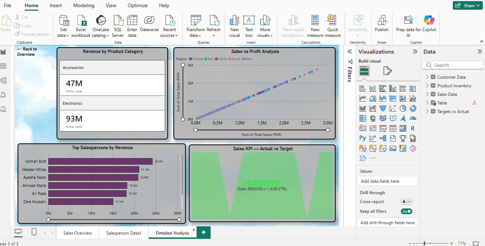

# Sales Dashboard — Power BI Project

## Pages
- Sales Overview — KPI cards, monthly trend, regional sales
- Salesperson Detail — Gauge chart, performance breakdown  
- Detailed Analysis — KPI visual, scatter chart, rankings

## Tools Used
- Microsoft Power BI Desktop
- 2 Tables: Sales Data + Targets vs Actual

## Screenshots

## Author
abubakar — Aspiring Data Analyst
